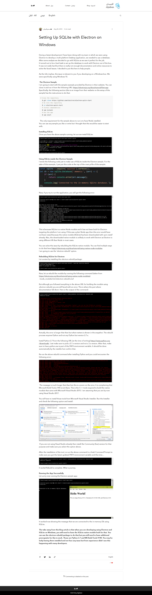

To Install:

git clone https://github.com/smailmalki/NodeCaisse.git

cd caissenode

npm install

npm install --global --production windows-build-tools  (<== this command need to be ran on administrator command window)
or install it manually https://visualstudio.microsoft.com/fr/downloads/

npm install electron-rebuild

.\node_modules\\.bin\electron-rebuild.cmd

npm start

#
#
#
#
#
#
#
#

#Personal notes:

"# NodeCaisse" 

https://github.com/electron/electron/blob/master/docs/tutorial/using-native-node-modules.md

https://www.aljaiban.com/post/setting-up-electron-with-sqlite-on-windows

npm install --global --production windows-build-tools

npm install electron-rebuild

.\node_modules\\.bin\electron-rebuild.cmd

??? modules / font-awesome ???
??? modules / virtual-keyboard-master ???

var i=0;
console.log(i.toFixed(2));

